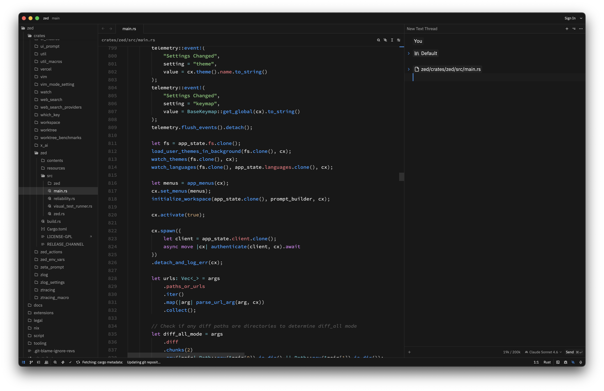
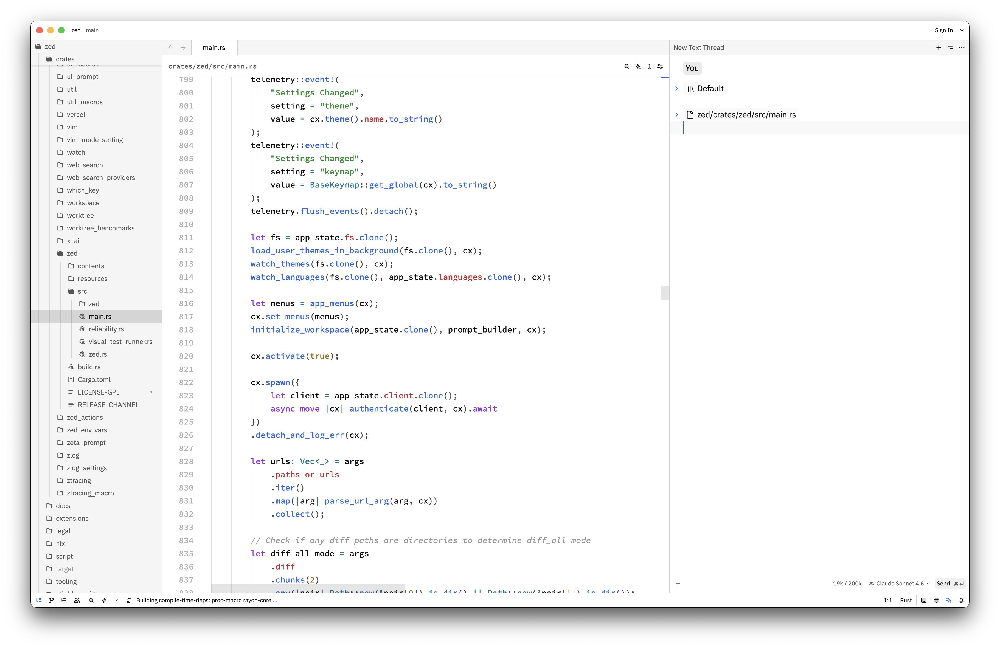

# Codex for Zed

A dark and light theme for [Zed](https://zed.dev) inspired by [Codex](https://developers.openai.com/codex/app).






## Variants

- **Codex Dark** — Deep `#181818` background, `#339CFF` blue accent, green strings, purple keywords
- **Codex Light** — Clean `#FFFFFF` background, `#2563EB` blue accent

## Install

### Via Zed Extensions (recommended)

1. Open Zed and go to **Extensions** (`Cmd+Shift+X`)
2. Search for **Codex**
3. Click **Install**
4. Open the command palette (`Cmd+Shift+P`), search for **theme**, and select **Codex Dark** or **Codex Light**

### Manual

Copy the theme file to your Zed themes directory:

```sh
mkdir -p ~/.config/zed/themes
cp themes/codex.json ~/.config/zed/themes/codex.json
```

Then open the command palette (`Cmd+Shift+P`) and search for **theme**, then select **Codex Dark** or **Codex Light**.

## Colors

### Dark

| Role       | Hex       |
|------------|-----------|
| Background | `#181818` |
| Foreground | `#E0E0E0` |
| Accent     | `#339CFF` |
| Strings    | `#7EC876` |
| Keywords   | `#C678DD` |
| Functions  | `#339CFF` |
| Types      | `#56B6C2` |
| Properties | `#E06C75` |
| Comments   | `#555555` |

### Light

| Role       | Hex       |
|------------|-----------|
| Background | `#FFFFFF` |
| Foreground | `#0D0D0D` |
| Accent     | `#2563EB` |
| Strings    | `#1A8A2F` |
| Keywords   | `#9333EA` |
| Functions  | `#2563EB` |
| Types      | `#0E7490` |
| Properties | `#C5232A` |
| Comments   | `#999999` |

## License

MIT
